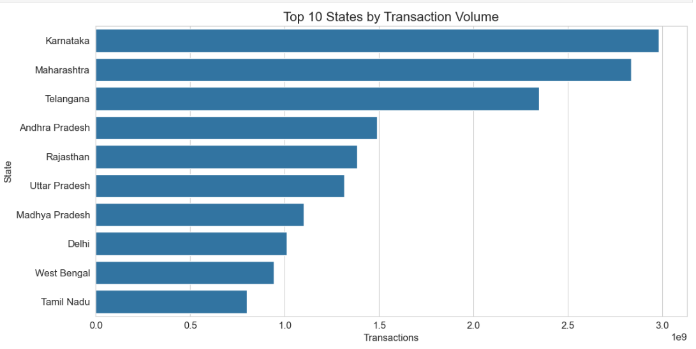
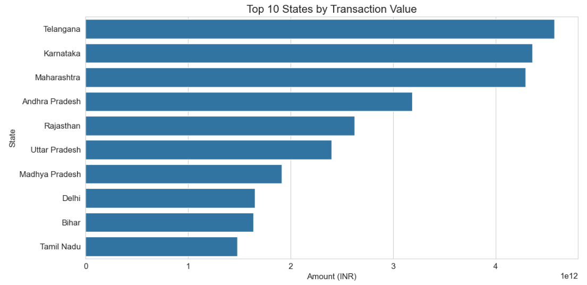
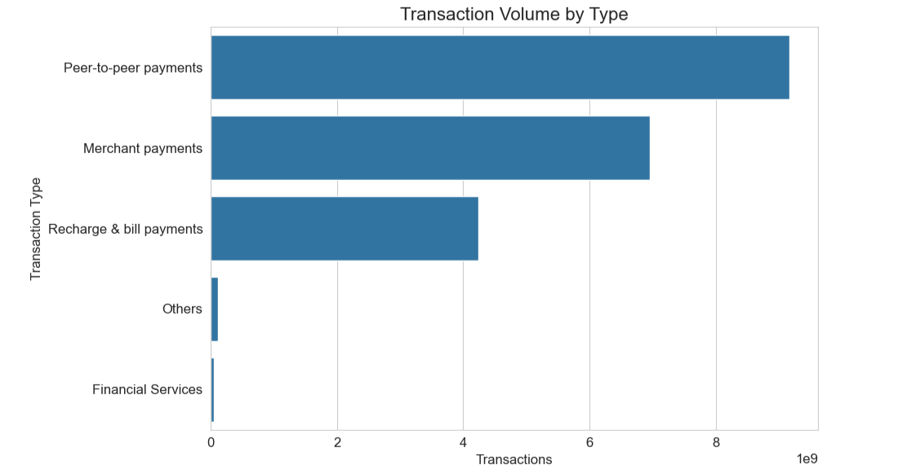
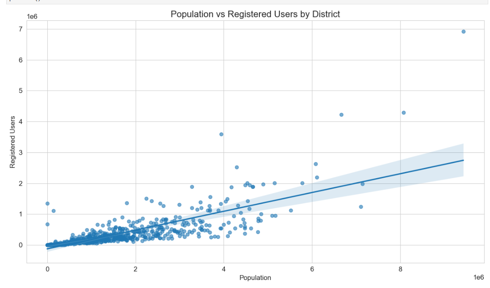
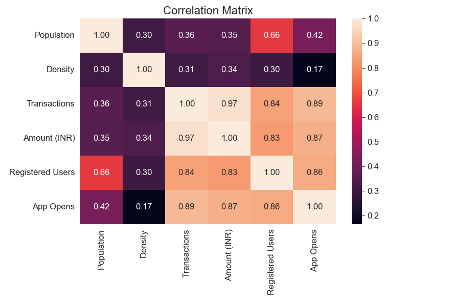
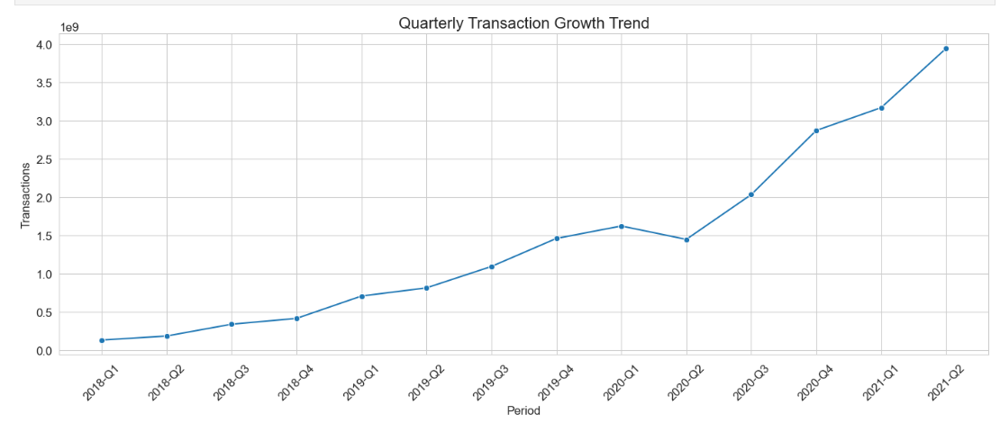
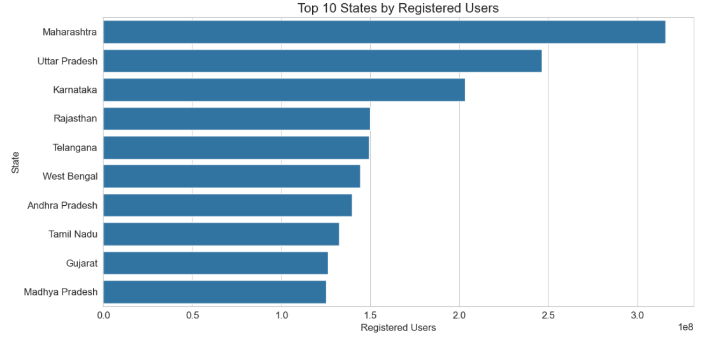
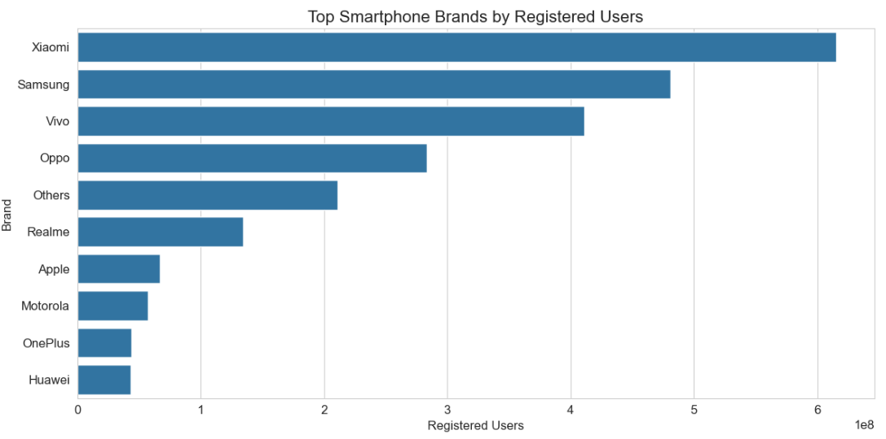

# 📊 Key Visualizations & Insights

## 1. Top 10 States by Transaction Volume

This visualization highlights the states contributing the highest number of digital payment transactions.

### Insight
- Maharashtra, Karnataka, and Uttar Pradesh emerged as major contributors to transaction activity.
- High transaction volume indicates strong digital payment adoption and user activity.

---

## 2. Top 10 States by Transaction Value

Analyzed states generating the highest total transaction value.

### Insight
- A few states contribute a significant share of the overall transaction value.
- High-value states indicate stronger purchasing power and greater digital payment penetration.

---

## 3. Transaction Volume by Type

Examined the contribution of different transaction categories to overall transaction volume.

### Insight
- Certain transaction categories dominate user activity.
- Understanding transaction behavior helps identify the most frequently used payment services.

---

## 4. Population vs Registered Users

Scatter plot showing the relationship between district population and registered PhonePe users.

### Insight
- A strong positive correlation was observed between district population and registered users.
- Some districts demonstrate higher-than-expected adoption, indicating strong digital payment penetration.

---

## 5. Correlation Heatmap

Visualized relationships among demographic and transaction-related variables.

### Insight
- Registered Users and App Opens exhibit a strong positive correlation.
- Population is positively associated with transaction activity and user adoption.

---

## 6. Quarterly Transaction Growth Trend

Analyzed transaction growth across quarters to understand the evolution of digital payments over time.

### Insight
- Transaction volume shows a consistent upward trend across quarters.
- Indicates increasing adoption and trust in digital payment platforms.

---

## 7. Top 10 States by Registered Users

Identified states with the largest PhonePe user base.

### Insight
- User adoption is concentrated in a few key states.
- States with larger user bases tend to contribute significantly to overall transaction activity.

---

## 8. Top Smartphone Brands by Registered Users

Examined smartphone brand preferences among PhonePe users.

### Insight
- A small number of smartphone brands account for the majority of PhonePe users.
- Device ecosystem analysis helps understand the technology driving digital payment adoption.

---

# 📌 Project Summary

## Objectives

- Analyze digital payment trends across India.
- Understand user adoption and engagement patterns.
- Identify high-performing states and districts.
- Study transaction behavior across categories.
- Explore the relationship between demographics and digital payment usage.

## Tools & Technologies

- Python
- Pandas
- NumPy
- Matplotlib
- Seaborn
- Jupyter Notebook

## Skills Demonstrated

- Data Cleaning
- Exploratory Data Analysis (EDA)
- Feature Engineering
- Data Visualization
- Correlation Analysis
- Business Insight Generation
- Data Storytelling
